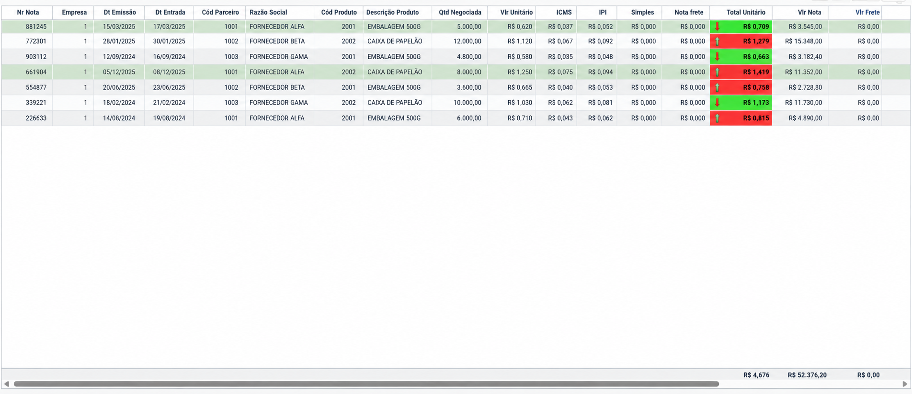

# Consulta analítica para apuração do custo real de compras

Projeto de **Oracle SQL e análise de dados** desenvolvido a partir de uma necessidade real do setor de compras de uma indústria alimentícia.

> Os dados, nomes e valores publicados neste repositório são fictícios. A estrutura foi anonimizada para preservar informações da empresa.

## Contexto

O preço unitário informado pelo fornecedor não representava, sozinho, o custo efetivo das matérias-primas. Para chegar ao custo real, o setor de compras considerava descontos, impostos, frete e custos adicionais, além de regras diferentes conforme a empresa e o tipo de operação.

Antes da solução, esses cálculos eram realizados manualmente e anotados em fichas físicas. Isso dificultava a consulta ao histórico, a comparação entre compras e a padronização das regras.

## Objetivo

Automatizar a composição do custo unitário real de cada item comprado e disponibilizar um histórico confiável para apoiar:

- comparação de preços e fornecedores;
- acompanhamento da evolução do custo dos produtos;
- conferência das compras;
- negociações com fornecedores;
- tomada de decisão do setor de compras.

## Solução desenvolvida

Foi criada uma consulta em Oracle SQL integrada aos dados do ERP, responsável por:

1. relacionar notas fiscais, itens, produtos e fornecedores;
2. calcular o valor líquido dos itens após descontos;
3. aplicar regras fiscais e operacionais específicas;
4. ratear o frete entre os itens da própria nota ou entre notas vinculadas ao mesmo CT-e;
5. distribuir custos adicionais pela quantidade adquirida;
6. calcular o custo unitário final;
7. recuperar o custo anterior do produto para comparação histórica;
8. alimentar uma tabela analítica parametrizada dentro do próprio Sankhya.

## Apresentação no Sankhya

A solução foi disponibilizada no ERP em formato de **tabela analítica**, preservando a familiaridade do setor de compras com consultas detalhadas. Cada linha representa uma aquisição e apresenta a composição do custo do produto.

A tabela permite:

- consultar o histórico de compras por produto;
- visualizar nota, empresa, datas, fornecedor e quantidade negociada;
- detalhar valor unitário, ICMS, IPI, Simples, frete e custos adicionais;
- apresentar o custo unitário total calculado;
- comparar o custo atual com o custo da compra anterior;
- destacar aumentos e reduções por meio de cores e indicadores direcionais;
- utilizar filtros por período, empresa, fornecedor, produto e uso do produto.

Esse formato foi escolhido porque a necessidade principal não era uma visão consolidada com gráficos, mas uma consulta operacional detalhada que permitisse ao comprador conferir a composição do custo e acompanhar seu histórico.

### Exemplo da solução



*Imagem recriada com dados totalmente fictícios para demonstrar a estrutura da solução sem expor informações da empresa.*

## Fluxo da solução


## Composição do custo

De forma simplificada, o cálculo utilizado no projeto é:

```text
Custo unitário final =
    valor unitário
  + ajuste de ICMS
  + IPI
  + Simples Nacional
  + substituição tributária
  + frete proporcional
  + custo adicional unitário
```

A aplicação de cada componente depende da empresa, do tipo de operação e das informações fiscais disponíveis.

## Destaques técnicos

- CTEs para separar extração, cálculo e comparação histórica;
- funções analíticas `SUM() OVER()` e `LAG()`;
- tratamento de valores nulos com `NVL()`;
- regras condicionais com `CASE`;
- rateio proporcional de frete e substituição tributária;
- tratamento de frete compartilhado entre notas por CT-e;
- filtros parametrizados por período, empresa, fornecedor e produto;
- integração entre regras de negócio e estrutura relacional do ERP.

## Tecnologias

- Oracle SQL
- ERP Sankhya
- Tabela analítica parametrizada no ERP Sankhya
- Levantamento de requisitos e validação com usuários

## Estrutura do repositório

```text
custo-real-compras/
├── README.md
├── data/
│   └── exemplo_calculo.csv
├── docs/
│   ├── dicionario-dados.md
│   ├── modelo-dados.md
│   └── regras-negocio.md
├── images/
│   └── tabela-analitica-custos.png
└── sql/
    ├── consulta_custo_real.sql
    └── exemplo_reproduzivel.sql
```

## Resultado

A solução substituiu a dependência de cálculos registrados apenas em fichas físicas por uma consulta digital e centralizada do histórico de custos. Também padronizou a aplicação das regras, facilitou a comparação entre aquisições e tornou mais rápida a identificação de aumentos e reduções no custo unitário.

> Por confidencialidade, não são divulgados dados reais nem indicadores internos da empresa. Os resultados descritos são qualitativos.

## Competências demonstradas

- análise e tradução de regras de negócio;
- levantamento de requisitos com a área usuária;
- Oracle SQL intermediário/avançado;
- modelagem e relacionamento de dados;
- automação de processos manuais;
- validação de cálculos e qualidade dos dados;
- comunicação entre áreas de negócio e tecnologia.
