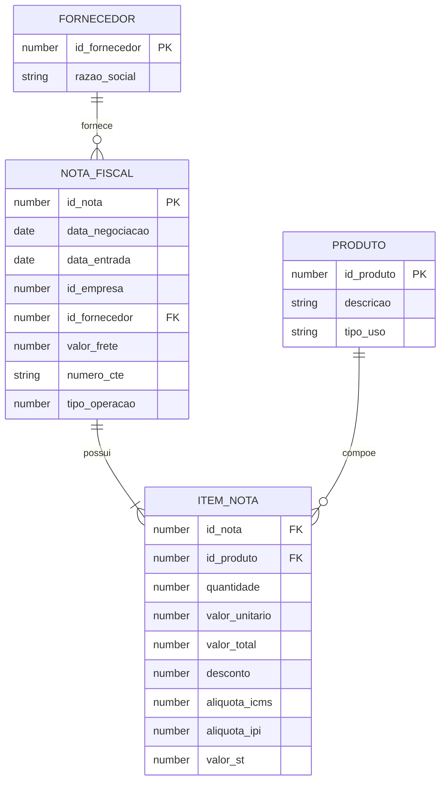

# Modelo de dados

O projeto utiliza uma estrutura relacional típica de um ERP.

## Correspondência no ERP

| Entidade lógica | Tabela utilizada | Finalidade |
|---|---|---|
| Nota fiscal | `TGFCAB` | Cabeçalho, fornecedor, empresa, datas, frete e operação |
| Item da nota | `TGFITE` | Produto, quantidade, valores, descontos e tributos |
| Fornecedor | `TGFPAR` | Identificação e razão social do parceiro |
| Produto | `TGFPRO` | Código, descrição e classificação de uso |

## Granularidade

O resultado principal possui uma linha por item de nota fiscal. A combinação da nota com o produto identifica cada compra analisada.

## Cuidados de modelagem

- O frete pode estar no nível da nota, mas precisa ser convertido para o nível do item.
- Um CT-e pode agrupar várias notas, alterando a base usada no rateio.
- A comparação histórica deve ser particionada por produto e ordenada por data e nota.
- Regras tributárias e tipos de operação devem ser tratados como parâmetros de negócio, não como fórmulas universais.

